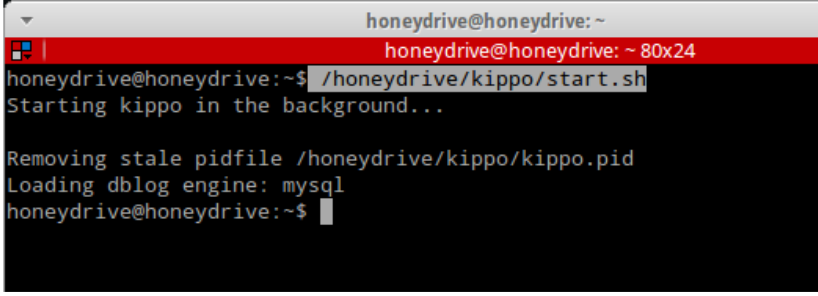
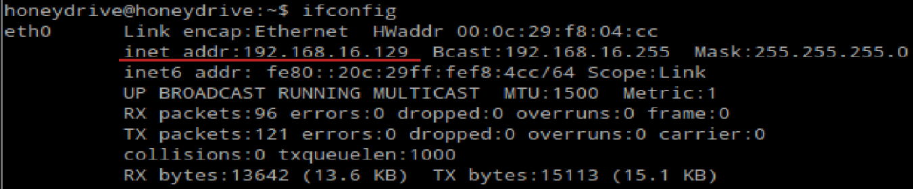
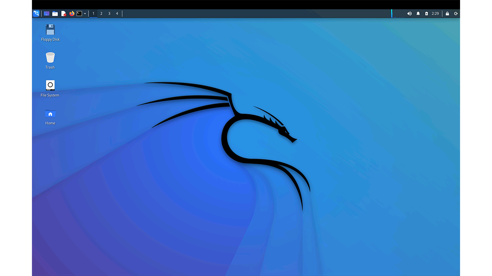
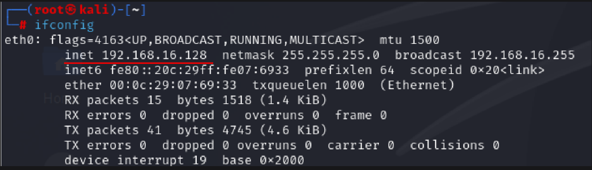
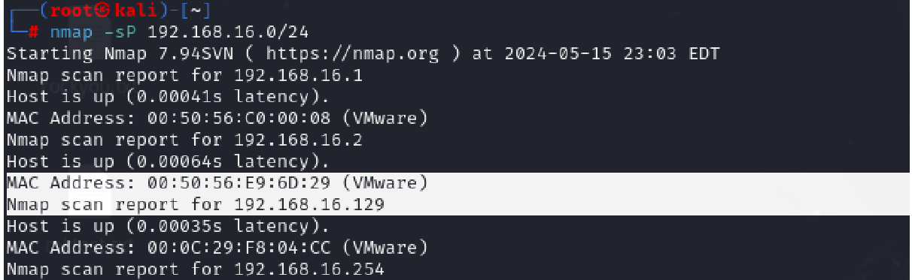
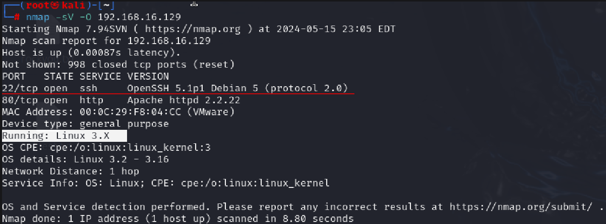
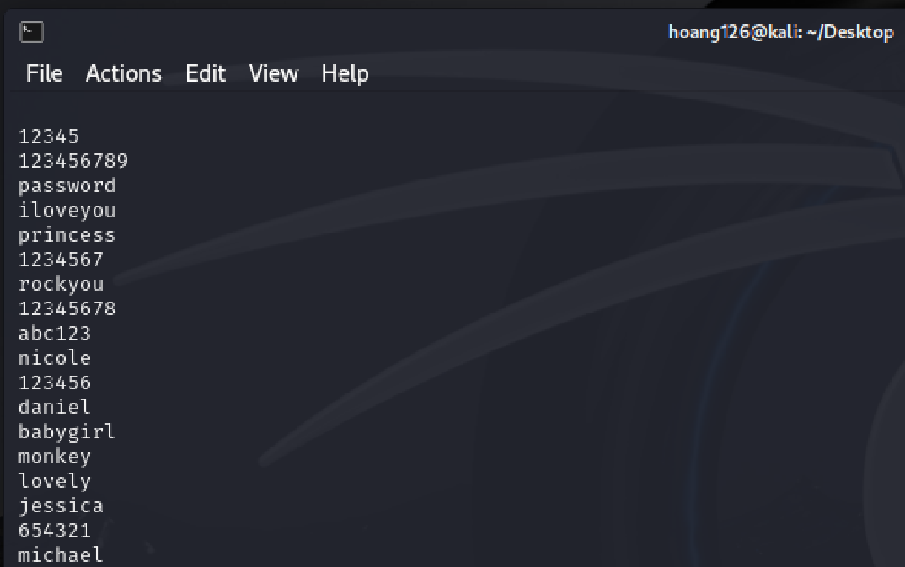
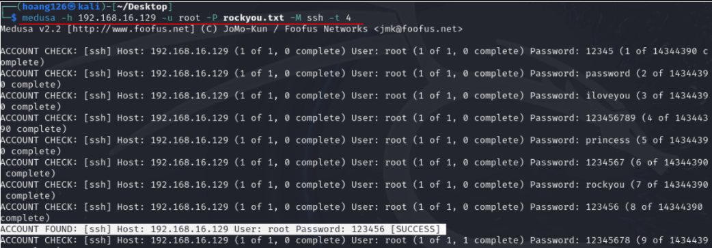
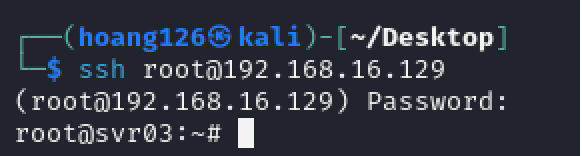
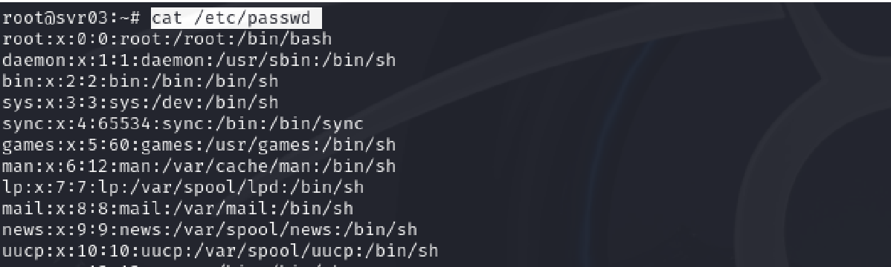

# SSH_HoneyDrive :honeybee:
How to use Kippo SSH honeypot to analyze a brute-fore attack.
## Description :page_with_curl:
This project help you have an overview how a honeypot works. We will use HoneyDrive 
which is a honeypot Linux Distro. It's a virtual appliance (OVA) with Xubuntu Desktop
installed. It has 10 pre-installed honeypot software packages. But in this project 
we will focus on using Kippo SSH honeypot to lure hackers and capture their signatures.

In this project, we will use Kali Linux as an Attacker :crossed_swords: and HoneyDrive 
as a victim :shield:. In Kali Linux, **_Nmap_** and **_Medusa_**(a brute-force tool) will 
be used.

## What are honeypots? :honey_pot:
Honeypots are designed as real parts of a network infrastructure such as 
a server or an end-host. But honeypots are modified to look like atractive targets for luring the hackers. Honeypots are used by the security teams to monitors the system's security resposes and redirect 
the attacker away from the real assets. 

## How do Honeypots work? :open_file_folder:
Honeypots are often designed to have vulnerabilites which often are decoy data. When the attackers break in
to the honeypots, the security team can observe how the hackers launched the attacks and take note their 
technique or signature. All these informations can be used to strengthen the security of real systems.  

## Installation :gear:

### 1, Install HoneyDrive.
**Step 1**: Download the OVA file from [bruteforce.gr](https://sourceforge.net/projects/honeydrive/) 

**Step 2**: Use a virtual machine application such as VMware or Virtual Box to create a new machine.

**Step 3**: Turn on the HoneyDrive.


**Step 4**: Start __kippo_ssh__.  
Open terminal and enter the command below: 
```
/honeydrive/kippo/start.sh
```
Wait for a moment and the kippo will be activated. :hourglass:
 

**Step 5**: Check the IP address.  
Using commnad: `ifconfig` or `ip add` 


**Step 6**: Visit the __Kippo_Graph__ website.  
Go to your browser in your real machine and enter the link below: 
```
HoneyDriveIPaddress/kippo-graph/
#In this case the Ip is 192.18.16.129
```
Kippo_Graph looks like this. 


### 2, Install Kali Linux.
**Step 1**: Download the version for virtual machine of Kali Linux.  
You can download it right [here](https://www.kali.org/get-kali/#kali-platforms). 

**Step 2**: Use your virtual machine app to install Kali.  
The desktop of Kali looks like this. 

> Welcome to the hacker world :V :detective:

**Step 3**: Check the IP address of this machine  
Using commnad: `ifconfig` or `ip add` 


## Launch the attack (Try to imagine you are a hacker :V). 
**Step 1**: Recognise the victim  
First of all, hacker have to use some tools to find vulnerable victims, this 
is the first step and the most crucial in the **__Cyber Kill Chain__** (we will talk about this one day :V).  
In this scenario, we will use `Nmap` to find out the victim which is our HoneyDrive machine.  

1. We have to scan all the IP addresses that are working in our network, so use the nmap with this command. 
``` 
sudo nmap -sP "Ipaddress range" 
#In this case my Ip range is: 192.168.16.0/24
```


*** You can see the IP address of the HoneyDrive machine appeared.  

2. Let take a deeper look in this machine and find the vulnerable points.   
To find out the O.S this machine is running and all of the ports are opening; we will use this command.
``` 
sudo nmap -sV -O "IP address" 
#In this case the IP address is 192.168.16.129
```

*** As we can see here, this machine is running __Linux O.S__, so it may be a server. In addition, 
the __22 port__ is also opening, which is a big problem for a server, because hackers can try to use SSH 
connection in this port and start a brute-force attack through this door. However, this is a honeypot machine, because
of that we want to open this port to atrract the attackers, so the attacker is trapped right now. :wink:

**Step 2**: Weaponize.  
>We will use dictionary-attack method, so it means we must have a dictionary, right?
>
Fortunately, you can find a thousand of dictionary like this in the Internet just by googling instead of speending hours to write
your own dictionary. In this scenario, we will use rockyou dictionary which is a basic dictionary for a simple pentesting. You can get it [here](https://github.com/praetorian-inc/Hob0Rules/tree/master).  
Ortherwise, you can try my username and password dictionary which is in the [rs](rs) folder and see how long does it take to break your account. :)))



**Step 3**: **__ATTACK!!!__**  
Let move to the fun part, **Hacking**. As i said before, we will use `medusa` to launch the attack. However, 
there is a more advance way to do this, it's using `Hydra`. Go and find it yourself :wink:    
1. Get back to your terminal  
Use this command: 
```
medusa -h "IpAddress" -u/U "username/UserNameFile" -p/P "password/passwordFile -M "connectionType" -t "number"

#In this case Ipaddress is 192.168.16.129
#I only test the username with 'root' for a faster test
#I use rockyou.txt file here 
#We are lauching SSH brute force so the connectionType must be ssh 
#Last one it number of thread you want to use, more thread means more quickly. 
#My command must be like this: medusa -h 192.168.16.129 -u root -P rockyou.txt -M ssh -t 4
```
*** Let the magic do it own work and patient... 
   
*** **Eureka!!!** so the password is '123456'. But in real life, if the password is so much simple like this, attackers
will noitice and aware they're being lured by a honeypot. So remmember to use medium strength password and it must be in the middle or last of the dictionary. 

2. Sneak in the system.  
We will use ssh connection here, so use this command.   
```
ssh@ipaddress 

#Mine is: ssh@192.168.16.129
```
Enter the password we have just found before. 

  
*** Now we are in.

3. Do some suspicious actions  
Now we're having the root privilege, so we can do whatever we want. I will use a common comand here just to show you how this works. 
```
cat /etc/passwd 
```

4. Get out as a ghost  
This part decides you're an elite hacker or just a noob, but in order to make the demostration more clearly, we will cross this part.

### Analyze the attack. 


